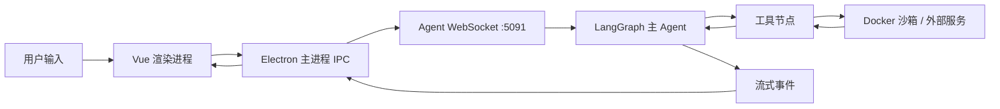

# CONTEXT.md · 领域事实与硬约束（单文档）

> 单一事实源：领域术语、技术栈事实、硬约束。  
> 与 `LANGUAGES.md` 互不重复：本文管「事实是什么」，`LANGUAGES.md` 管「用哪些词」。  
> 与 `AGENTS.md` 互不重复：本文管「业务/技术是什么」，`AGENTS.md` 管「Agent 怎么干活」。  
> 深度分析只读参考：`canvases/apix-agent-deep-analysis.canvas.tsx`（以本仓实码为准）。

## 1. 产品定位

**APIX** 是开源 **AI Agent 协作平台**（桌面端为主）：把「说一句话」变成「多个 Agent 并行干活」。

- 面向：想用 Agent 自动化工作的使用者，以及二次开发者。
- 形态：Electron 桌面客户端 + 四个本地 Python 微服务 + Docker 沙箱。
- 不是：纯聊天 UI、纯 Prompt 库、或无运行时的 Agent 框架文档仓。

## 2. 技术栈事实

| 维度 | 值 | 依据 |
|---|---|---|
| 客户端 | Electron 37 · Vue 3.5 · Pinia · Vue Router · Element Plus · CodeMirror 6 · electron-vite | `CLIENT/apix-app/package.json` |
| Agent 运行时 | Python ≥3.11 · FastAPI · Uvicorn · LangGraph · LangChain · Docker sandbox | `AGENT/agent_module/pyproject.toml` |
| Memory | Python · FastAPI · MySQL · Redis | `MEMORY/memory_module/` |
| File / RAG | Python · FastAPI · MySQL · Milvus（可选）· Embedding 适配 | `FILE/file_service/` |
| Task flow | Python · FastAPI · 任务流 DSL / 执行引擎 | `TASK/task_flow_module/` |
| Python 包管理 | `uv` + 各模块独立 `pyproject.toml` / `uv.lock` | 各服务目录 |
| 客户端包管理 | npm + Volta（Node 22.19.0） | `CLIENT/apix-app/package.json` |
| 许可证 | GNU GPL v3.0 | 根 `LICENSE` |
| 测试 | 仓库内暂无系统化测试套件 | `CLAUDE.md` |

## 3. 仓库边界（产品层根）

本仓是 **多服务 monorepo**，无单一 `src/`。产品层边界：

| 路径 | 职责 |
|---|---|
| `CLIENT/apix-app/` | Electron 主进程 / preload / Vue 渲染进程 |
| `AGENT/agent_module/` | Agent 运行时（WebSocket · LangGraph · 工具 · 沙箱） |
| `MEMORY/memory_module/` | 会话 / 消息节点 / 用户 / Provider / MCP 配置 |
| `FILE/file_service/` | 文件 · RAG · Skill 文件 · 向量检索 |
| `TASK/task_flow_module/` | 任务流调度与执行 |
| `README/` | 中英文部署文档与安装脚本资源（含沙箱 Dockerfile、MySQL init） |
| `setup.ps1` / `setup.sh` | 一键安装入口 |

**禁止**把业务服务代码迁入 `docs/` 或 `assets/`。

## 4. 服务拓扑与端口

| 服务 | 默认端口 | 职责 |
|---|---:|---|
| Task flow | 5090 | 任务流调度与执行 |
| Agent runtime | 5091 | WebSocket 网关、LLM 流式、工具、多 Agent 调度 |
| Memory | 5093 | 会话、用户、消息树、角色卡、Provider/MCP 设置 |
| File | 5094 | 文件记录、RAG、Embedding、向量检索 |

依赖容器（setup 脚本拉起）：

| 依赖 | 典型地址 | 备注 |
|---|---|---|
| Redis | `localhost:6379` | 缓存 / 队列 |
| MySQL | `localhost:3307`（容器内 3306） | 凭据见部署文档；库名 `apix_database` |
| Milvus | `http://localhost:19530` | RAG 可选 |
| Ollama | `http://localhost:11434` | 本地模型 / Embedding 可选 |
| Docker sandbox | 镜像 `agent-sandbox:latest` | 来自 `README/script/AgentSandbox/` |

默认基址硬编码于：`CLIENT/apix-app/src/main/config.js` 与各服务 `global_config.py`。改端口须同步多处。

## 5. 主链路（对话）

要点（实现细节见 `CLAUDE.md`）：

1. Renderer → `window.api.chatComplations` → IPC `api:chat`
2. 主进程 WebSocket 发 `chat_with_llm`
3. Agent 服务编译/执行 LangGraph；主/子 Agent 权限分级
4. 工具可走文件 / 搜索 / 代码沙箱 / MCP / 向量检索
5. 事件经 WebSocket 回流；消息节点支持分支编辑

## 6. 硬约束

- **不写业务功能代码**于本轮 project-init；后续业务须 PRD 批准后再实施。
- **密钥不上库**：用户 API Key / Provider 端点存本地 MySQL，禁止提交 `.env` 真密钥。
- **示例凭据仅限本地**：代码/文档中的演示 MySQL 口令、AES 示例密钥、Milvus 默认口令**不得**当作生产凭据；后续业务 theme 应外置到环境变量（见 §7）。
- **部署边界**：服务默认绑定 `0.0.0.0`、客户端指向 `127.0.0.1`；当前无统一网关鉴权 / 服务间 mTLS——**仅适合本机或受信局域网，禁止直接公网暴露**。
- **沙箱安全**：代码执行依赖 Docker；仅建议在受信任本机/私网启用。
- **端口硬编码**：改端口必须同步 client `config.js` 与各 `global_config.py`。
- **Router 自动发现**：Python 服务扫描 `routers` 包挂载 `APIRouter`；新增路由按此约定。
- **线性任务流编辑**：README 注明相关代码已损坏，后续版本修复——勿在文档里写成「已完备」。
- **单一事实源**：禁止新建 `docs/agents/language.md` / `docs/agents/context.md`。
- **媒体路径**：README 配图契约目录为 `assets/images/readme/`；禁止新建 `docs/images/`。目录结构以 README Markdown 树为准，不依赖 `structure.png`。

## 7. 已知缺口与待确认

| 项 | 状态 |
|---|---|
| 系统化单元/集成/E2E 测试 | 缺失（全仓约 0 测试文件） |
| 示例密钥 / 口令外置与最小鉴权 | 高优缺口（见深度分析 canvas Risks） |
| 服务绑定与公网暴露防护 | 高优缺口；开发默认应偏向本机 |
| 端口 / URL 共享配置层 | 中优；改动易漏多处硬编码 |
| 图任务流编辑 | 进行中（README Progress） |
| 工作区时间旅行 / 定时任务 / 插件市场 / 多平台接入 | 未开始 |
| 线性任务流编辑代码损坏 | 【待确认】修复排期与影响面 |
| 遗留文件 / 本机绝对路径配置 | 【待确认】清理排期（业务 theme，非 init） |
| 上游与本 fork 关系 | 远端 `Aafff623/fork-Apix-Agent`；分支 `Version_2.1` |

## 8. 资源与外部依赖

| 资源 | 路径 / 链接 |
|---|---|
| 本 fork 远端 | https://github.com/Aafff623/fork-Apix-Agent |
| 中文部署文档 | `README/README_zh.md` |
| English Docs | `README/README_en.md` |
| MySQL init | `README/script/init_mysql_backup.sql` |
| 沙箱 Dockerfile | `README/script/AgentSandbox/Dockerfile` |
| 深度分析 canvas | `canvases/apix-agent-deep-analysis.canvas.tsx` |
| Issue tracker（本仓默认） | 本地 `.scratch/<feature>/` markdown |
| 社区 | Discord / QQ（见根 `README.md`） |

## 9. 术语（仅防歧义）

完整共享词汇见 `LANGUAGES.md`。本节只固化不可二义项：

- **主 Agent / 子 Agent**：LangGraph 权限分级（`main` / `sub`），不是「用户 vs 系统」账号角色。
- **消息节点**：可分支编辑的消息树节点，不是 DOM 节点。
- **任务流**：`TASK` 服务编排的自动化流水线；与 git 任务分支不是同一概念。
- **Preview（README）**：本仓**无**资产 Gallery Preview 站；仅有 README 本地预览壳 `preview-readme.*`。
- **Showcase**：产品主链路真机截图（`assets/images/readme/showcase-*.png`）。
