<div align="center">

# APIX

*开源 AI Agent 协作平台 —— 构建、协作、执行，让多智能体真正为你工作*

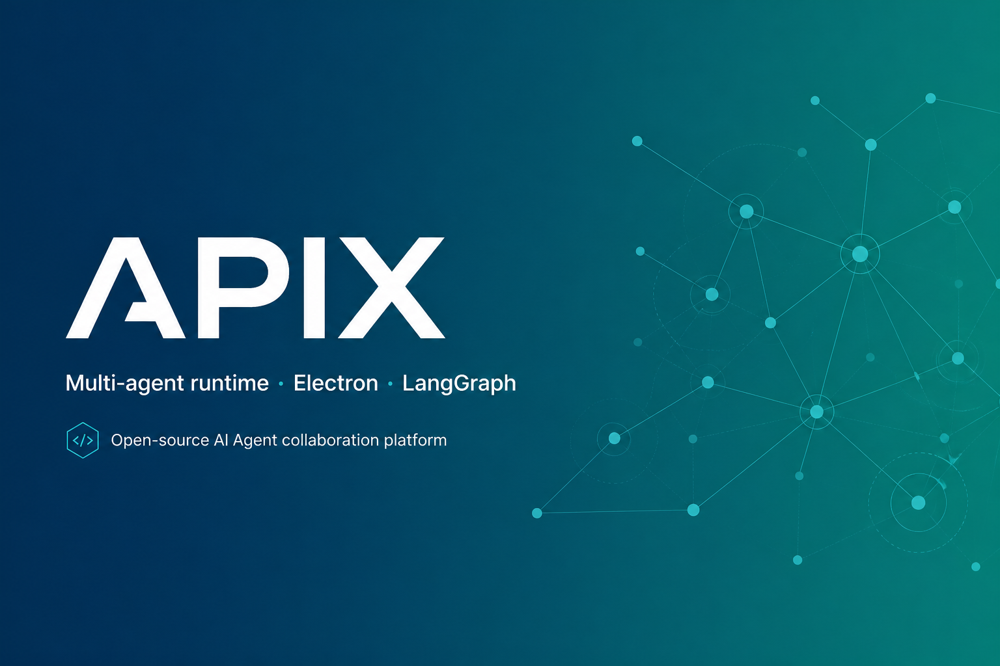

<p align="center">
  
  
  
  
  
</p>

<p align="center">
  <a href="#why">为什么</a> ·
  <a href="#features">功能</a> ·
  <a href="#preview">Preview</a> ·
  <a href="#showcase">Showcase</a> ·
  <a href="#quick-start">快速开始</a> ·
  <a href="#architecture">架构</a> ·
  <a href="#workflow">主链路</a> ·
  <a href="#structure">目录结构</a> ·
  <a href="#roadmap">路线图</a> ·
  <a href="#docs">文档</a>
</p>

</div>

---

## 为什么需要 {#why}

多数 AI 工具停在「单轮对话」：任务一复杂就掉链子。

APIX 的判断是：**真正有用的不是更会聊天的模型，而是能组织多个 Agent 一起完成任务的系统**。它把一次请求拆成可并行、可追踪、可回滚的子任务，让不同角色的 Agent 在沙箱里安全调用工具、读写文件、检索知识。

| 痛点 | APIX 收敛 |
|---|---|
| 单 Agent 扛不住复杂任务 | 主/子 Agent 调度与并行 |
| 代码执行不安全 | Docker 沙箱隔离 |
| 供应商锁定 | 多 Provider / MCP 可插拔 |
| 上下文失控 | 多级记忆 + 消息节点分支 |

---

## 功能 {#features}

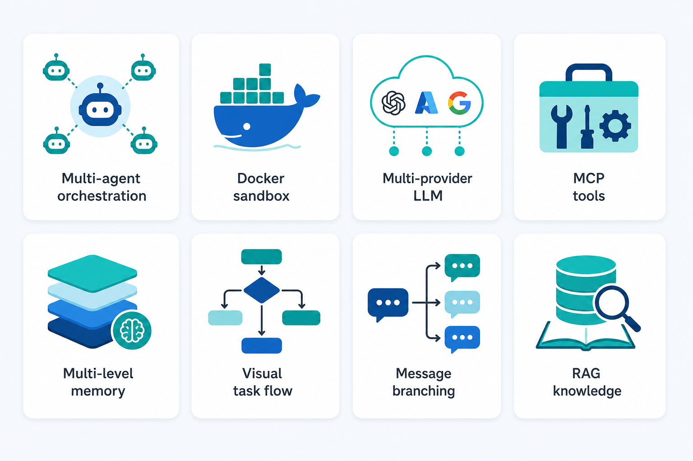

| 能力 | 说明 |
|---|---|
| 多智能体协作 | Leader 调度子代理并行；内置文件访问冲突检测 |
| Docker 安全沙箱 | 代码与命令在隔离环境执行 |
| 多模型供应商 | OpenAI / DeepSeek / MoonShot / Ollama / 自定义 |
| 多协议 MCP | 支持生命周期自定义的 MCP 工具 |
| 多级记忆 | 工作区记忆容器 + 上下文压缩 |
| 可视化任务流 | 卡片化编排自动化流水线 |
| 消息节点化 | 任意位置编辑/删除消息并生成分支 |
| RAG 知识库 | 文档向量检索，Embedding 可插拔 |

> 边界：线性任务流编辑相关代码已损坏，将在后续版本修复；图任务流编辑进行中。事实以 `CONTEXT.md` 为准。

---

## Preview {#preview}

**本仓无独立 Preview 站（资产 Gallery）。**

APIX 是单产品 Electron + 多服务平台，不是组件库 / 多 demo / 多模板仓，因此 README 以 **Showcase** 展示产品主链路。  
若只需预览本 README 排版，使用根目录 **README 本地预览壳**：

```powershell
# 在仓库根执行
python -m http.server 8090
# 浏览器打开：
# http://127.0.0.1:8090/preview-readme.html
```

---

## 演示 / Showcase {#showcase}

### 推荐演示路径

1. 运行 `setup.ps1` / `setup.sh` 完成依赖与数据库初始化  
2. 启动 Task / Agent / Memory / File 四服务（端口见架构表）  
3. `cd CLIENT/apix-app && npm run dev` 打开桌面客户端  
4. 配置 Provider → 新建对话 → 触发工具/沙箱调用 → 查看消息分支与设置页  

### Showcase 相册

| 槽位 | 图 |
|---|---|
| 主对话 | 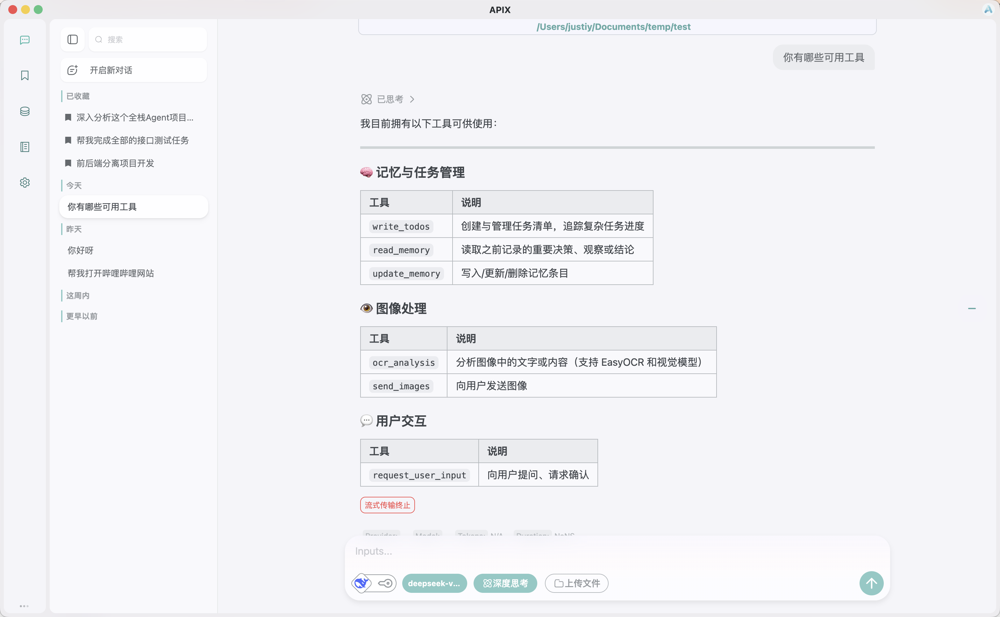 |
| 编辑器 | 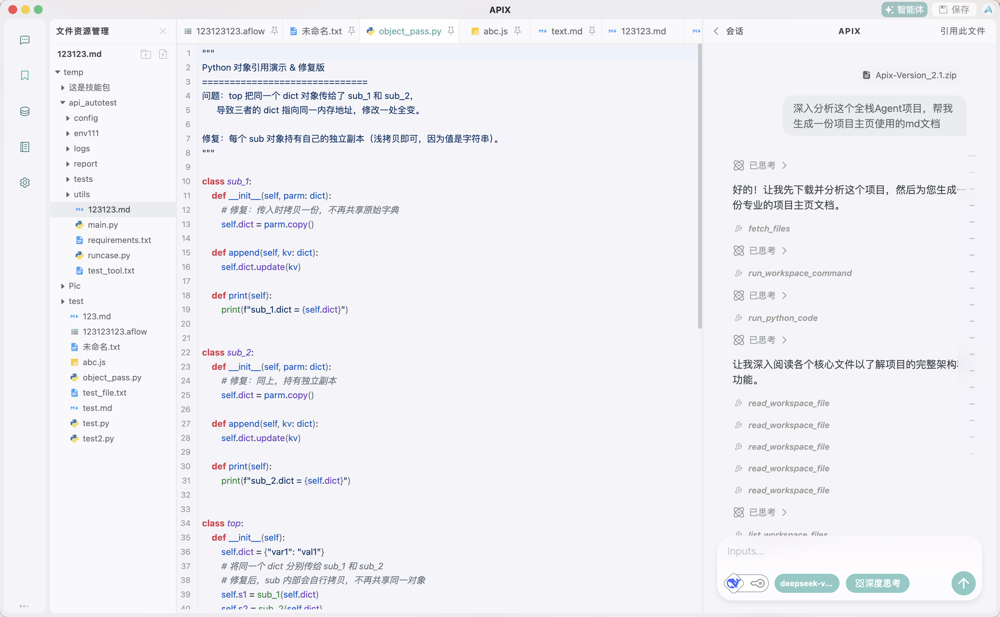 |
| 设置 | 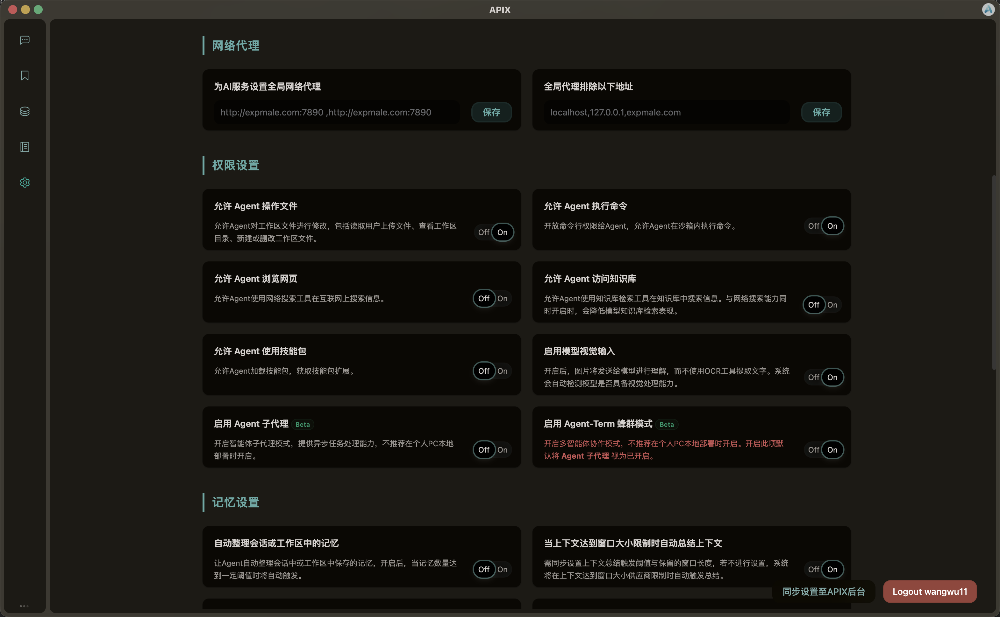 |
| 工作区 | 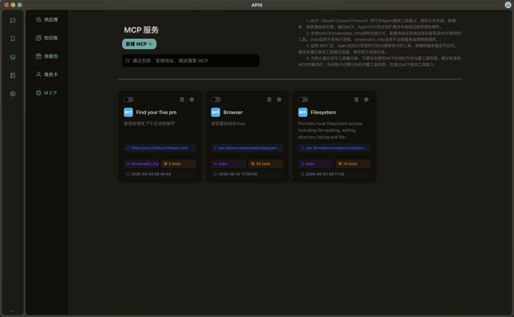 |

> 截图来自仓库历史真机资源（`README/source/` → `assets/images/readme/showcase-*.png`）。功能演进后可用 Playwright 替换。

---

## 快速开始 {#quick-start}

### 一键安装

Windows（PowerShell）：

```powershell
Set-ExecutionPolicy Bypass -Scope Process -Force
.\setup.ps1
```

macOS / Linux：

```bash
chmod +x setup.sh
./setup.sh
```

### 开发时启动服务

```bash
# Agent :5091
cd AGENT/agent_module && uv sync && uv run main.py

# Memory :5093
cd MEMORY/memory_module && uv sync && uv run main.py

# File :5094
cd FILE/file_service && uv sync && uv run main.py

# Task :5090
cd TASK/task_flow_module && uv sync && uv run main.py

# Client
cd CLIENT/apix-app && npm install && npm run dev
```

详细步骤：[中文部署文档](./README/README_zh.md) · [English Docs](./README/README_en.md)

---

## 架构 {#architecture}

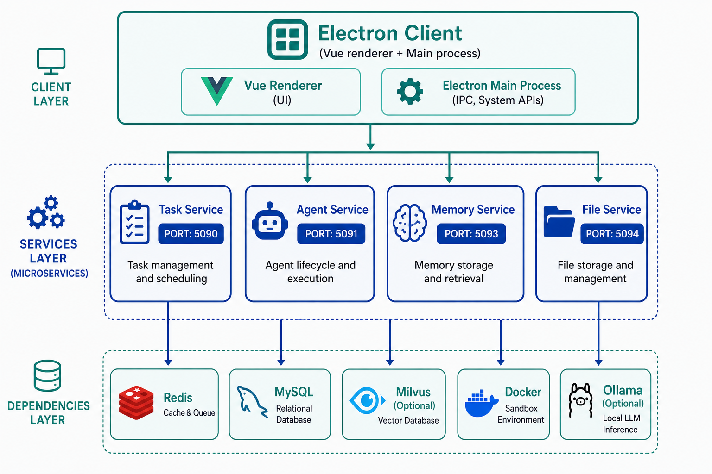

| 服务 | 端口 | 职责 |
|---|---:|---|
| Task flow | 5090 | 任务流调度与执行 |
| Agent runtime | 5091 | WebSocket、LangGraph、工具、多 Agent |
| Memory | 5093 | 会话、消息节点、用户、Provider/MCP |
| File | 5094 | 文件、RAG、Embedding、向量检索 |
| Electron Client | — | 主进程 IPC + Vue 渲染进程 |

### 技术栈

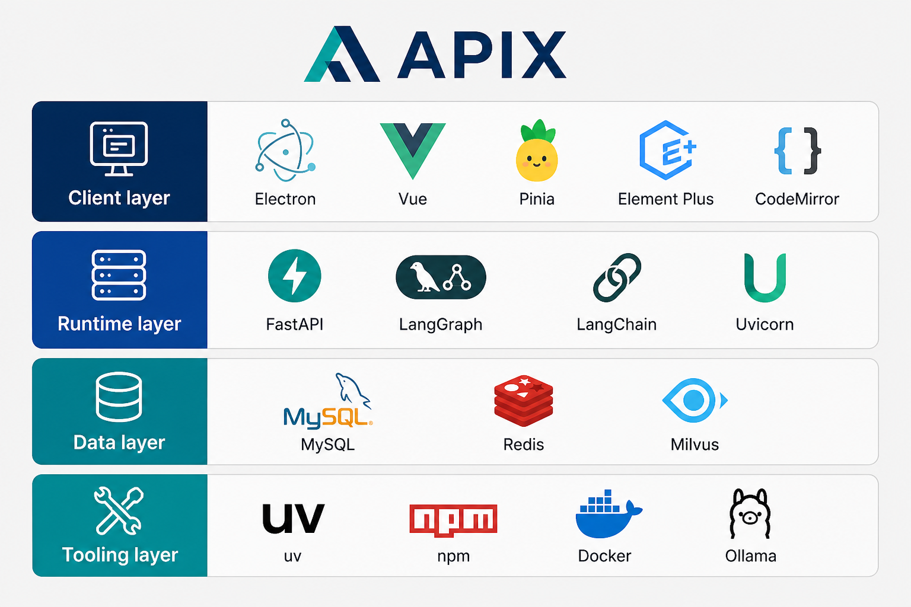

| 层 | 技术 |
|---|---|
| 客户端 | Electron 37 · Vue 3.5 · Pinia · Element Plus · electron-vite |
| 运行时 | FastAPI · Uvicorn · LangGraph · LangChain · Docker sandbox |
| 数据 | MySQL · Redis · Milvus（可选）· Ollama（可选） |
| 包管理 | `uv`（Python）· npm + Volta（Client） |

---

## 用户主链路 {#workflow}

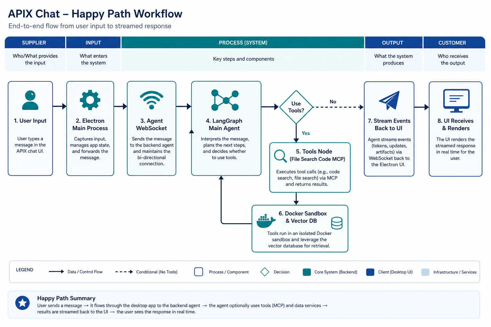

1. 用户在桌面客户端输入请求  
2. 主进程经 WebSocket 转发到 Agent 服务（`:5091`）  
3. LangGraph 主 Agent 决策并调度工具 / 子 Agent  
4. 工具在 Docker 沙箱或外部服务中执行  
5. 流式事件回传，渲染进程更新消息树  

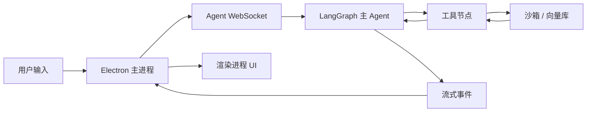

---

## 目录结构 {#structure}

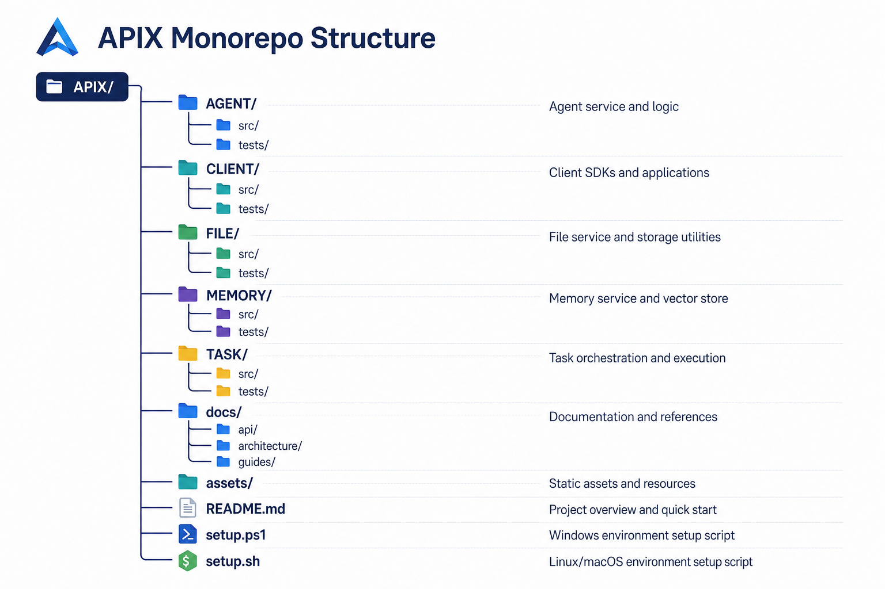

```text
.
├── AGENT/agent_module/         # Agent 运行时 (FastAPI + LangGraph)
├── CLIENT/apix-app/            # Electron + Vue 3 桌面客户端
├── FILE/file_service/          # 文件与 RAG 服务
├── MEMORY/memory_module/       # 记忆与会话服务
├── TASK/task_flow_module/      # 任务流服务
├── docs/                       # Agent 流程 · ADR · outputs
├── assets/images/readme/       # README 配图与 Showcase
├── README/                     # 中英文部署文档与安装脚本资源
├── canvases/                   # 深度分析 canvas（只读参考）
├── preview-readme.html         # README 本地预览壳
├── AGENTS.md · CONTEXT.md · LANGUAGES.md · CLAUDE.md
├── setup.ps1                   # Windows 一键安装
└── setup.sh                    # macOS/Linux 一键安装
```

| 路径 | 职责 |
|---|---|
| `AGENT/.../apix_agent_core/` | LangGraph 图、工具、沙箱管理 |
| `CLIENT/.../src/main/` | Electron 主进程、WebSocket、IPC |
| `CLIENT/.../src/renderer/` | Vue 页面、路由、Pinia |
| `MEMORY/.../core/domain/` | MySQL / Redis 数据层 |
| `FILE/.../core/domain/` | Milvus / 文件元数据 |
| `TASK/.../app/core/` | 任务流执行引擎 |

---

## 路线图 {#roadmap}

| 模块 | 状态 | 说明 |
|---|:---:|---|
| 多智能体运行时 | ✅ | LangGraph 主/子 Agent |
| MCP 集成 | ✅ | 生命周期可自定义 |
| 可视化线性任务流 | ✅ | 卡片化；**代码损坏待修** |
| Docker 沙箱 | ✅ | Ubuntu 22.04 基础镜像 |
| 图任务流编辑 | 🟡 | 非线性编排 |
| 工作区时间旅行 | ⬜ | 快照与回滚 |
| 定时任务 | ⬜ | 计划触发 |
| 插件市场 | ⬜ | 第三方扩展 |
| 多平台接入 | ⬜ | Web / 移动端 |

---

## 文档 {#docs}

| 文档 | 路径 |
|---|---|
| Agent 硬约束 | [`AGENTS.md`](./AGENTS.md) |
| 维护协议 / 运行说明 | [`CLAUDE.md`](./CLAUDE.md) |
| 领域事实 | [`CONTEXT.md`](./CONTEXT.md) |
| 共享用词 | [`LANGUAGES.md`](./LANGUAGES.md) |
| 任务流 | [`docs/agents/workflow.md`](./docs/agents/workflow.md) |
| ADR | [`docs/adr/`](./docs/adr/) |
| 媒体约定 | [`assets/README.md`](./assets/README.md) |
| 中文部署 | [`README/README_zh.md`](./README/README_zh.md) |
| English Docs | [`README/README_en.md`](./README/README_en.md) |
| Init 调研报告 | [`docs/outputs/report/project-init/`](./docs/outputs/report/project-init/) |

社区：[Discord](https://discord.gg/bsTqEzJmJ) · QQ 群见历史 README 链接。

---

## Privacy

- 核心服务默认本地运行；模型调用需自行配置 API Key 或 Ollama。  
- API Key / 自定义 Provider 端点仅存本地 MySQL，不上传项目方服务器。  
- Docker 沙箱建议仅在受信任本机或私有网络启用。  

---

## License

本项目基于 **GNU GPL v3.0** 协议开源。
