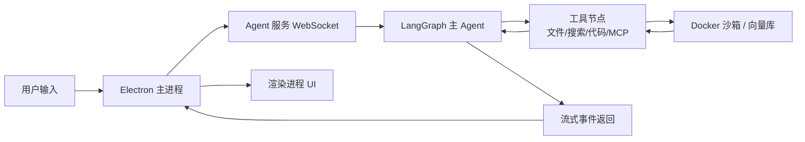

<div align="center">

# APIX

**开源 AI Agent 协作平台**

构建、协作、执行——让多智能体真正为你工作


<p align="center">
  
  
  
  
  <a href="https://discord.gg/bsTqEzJmJ"></a>
  
</p>

<p align="center">
  <a href="#highlights">亮点</a> ·
  <a href="#origin">起源</a> ·
  <a href="#progress">进程</a> ·
  <a href="#repo-structure">仓库结构</a> ·
  <a href="#workflow">工作流</a> ·
  <a href="#links">链接</a>
</p>

</div>

---

## ✨ Highlights (亮点聚焦)

APIX 不是另一个聊天界面。它是一套**完整的 Agent 运行时**，把「说一句话」变成「多个 Agent 并行干活」：

- **🤖 多智能体协作** — Leader 调度多个子代理并行工作，复杂任务自动分解，内置文件访问冲突检测
- **🐳 代码安全沙箱** — Docker 隔离执行，代码和命令不会破坏宿主系统
- **🔌 多模型供应商兼容** — OpenAI / DeepSeek / MoonShot / Ollama / 自定义供应商任意切换
- **⚒️ 多协议 MCP 兼容** — 支持多种 MCP 服务，可自定义会话生命周期
- **🧠 多级记忆系统** — 工作区级记忆容器 + 自动上下文压缩，记忆可控
- **🎨 可视化任务流** — 卡片化任务流编辑，定制自动化流水线
- **💬 消息节点化管理** — 任意位置编辑或删除已发送消息，自动生成新分支
- **📚 RAG 知识库** — 文档向量化检索，嵌入模型可插拔

---

## 🌱 Origin (起源)

现有的 AI 工具大多停留在「单轮对话」：你提问，模型回答，任务一复杂就掉链子。

APIX 的诞生基于一个判断：**真正有用的 AI 不是更会聊天的模型，而是能组织多个 Agent 一起完成任务的系统**。它把一次用户请求拆成可并行、可追踪、可回滚的子任务，让不同角色的 Agent 在沙箱里安全地调用工具、读写文件、检索知识，最终交付可验证的结果。

这个项目同时面向「想用 Agent 自动化工作的人」和「想在此基础上二次开发的开发者」。

---

## 📊 Progress (项目进程)

| 模块 | 状态 | 说明 |
|------|:----:|------|
| 多智能体运行时 | ✅ 已完成 | 基于 LangGraph 的主/子 Agent 调度 |
| MCP 集成支持 | ✅ 已完成 | 支持生命周期自定义 |
| 可视化线性工作流编辑器 | ✅ 已完成 | 卡片化编排 |
| Docker 安全沙箱 | ✅ 已完成 | Ubuntu 22.04 基础镜像 |
| 图任务流编辑 | 🟡 进行中 | 下一代非线性编排 |
| 工作区时间旅行 | ⬜ 未开始 | 状态快照与回滚 |
| 定时任务管理 | ⬜ 未开始 | 计划任务触发 |
| 插件市场 | ⬜ 未开始 | 第三方扩展生态 |
| 多平台接入 | ⬜ 未开始 | Web / 移动端 |

> **注意**：线性任务流编辑相关代码已损坏，将在后续版本中修复。

---

## 📂 Repo-Structure (仓库结构)

```text
.
├── AGENT/agent_module/         # Agent 运行时服务 (FastAPI + LangGraph)
├── CLIENT/apix-app/            # Electron + Vue 3 桌面客户端
├── FILE/file_service/          # 文件与 RAG 服务
├── MEMORY/memory_module/       # 记忆与会话服务
├── TASK/task_flow_module/      # 任务流服务
├── README/                     # 中英文部署文档
├── setup.ps1                   # Windows 一键安装
└── setup.sh                    # macOS/Linux 一键安装
```

<details>
<summary>展开查看详细模块职责</summary>

| 路径 | 职责 |
|------|------|
| `AGENT/agent_module/apix_agent/apix_agent_core/` | LangGraph Agent 图构建、工具注册、沙箱管理 |
| `CLIENT/apix-app/src/main/` | Electron 主进程、WebSocket 客户端、IPC 桥接 |
| `CLIENT/apix-app/src/renderer/` | Vue 3 渲染进程、页面路由、状态管理 |
| `MEMORY/memory_module/core/domain/` | MySQL / Redis 数据层 |
| `FILE/file_service/core/domain/` | Milvus 向量检索、文件元数据 |
| `TASK/task_flow_module/app/core/` | 任务流执行引擎 |

</details>

---

## ⚙️ Workflow (工作流)

一次典型对话在 APIX 中的流转：



1. 用户在桌面客户端输入请求
2. 主进程通过 WebSocket 转发到 Agent 服务
3. Agent 服务编译并执行 LangGraph，主 Agent 决定调用哪些工具
4. 工具在 Docker 沙箱或外部服务中安全执行
5. 每个事件通过 WebSocket 流回客户端，UI 实时更新

---

## 🚀 Quick Start (快速开始)

### 一键安装

Windows（PowerShell）：

```powershell
Set-ExecutionPolicy Bypass -Scope Process -Force
.\setup.ps1
```

macOS / Linux：

```bash
chmod +x setup.sh
./setup.sh
```

> 安装过程中请保持网络畅通。

### 手动部署

详细步骤见：

- [中文部署文档](./README/README_zh.md)
- [English Docs](./README/README_en.md)

---

## 🔗 Link (关键链接)

| 资源 | 链接 |
|------|------|
| 中文部署文档 | [`README/README_zh.md`](./README/README_zh.md) |
| English Docs | [`README/README_en.md`](./README/README_en.md) |
| 加入社区 | [QQ 群](https://qun.qq.com/universal-share/share?ac=1&authKey=ommoQrT2zhzHU%2FUxv8pfGCJbNifW%2BJyUAFBkNdzkHTPUxdxCnlgxm5aNgGslTmdE&busi_data=eyJncm91cENvZGUiOiI2Mzk0NTkxNzIiLCJ0b2tlbiI6Im9ZZkdNUWZnSVV1Y2REeUhKNnlTbWEwc05Bb093djRzUXdXNE55dklBVnlBQk9XbGNpS0ZXSDlzK3orSW1sQ3YiLCJ1aW4iOiIzMTI5NDI0NTcyIn0%3D&data=OGTchcr80RAQg8Z8_GZTdvBb7kZDeM9B3hHcNqLaAX2ZK_KYq260C4CubblEBT1bK5fP6zgtnCk2D8fIoph1ZQ&svctype=4&tempid=h5_group_info) / [Discord](https://discord.gg/bsTqEzJmJ) |

---

## 🔒 Privacy (隐私提醒)

- APIX 默认在本地运行核心服务（Agent、Memory、File、Task），模型调用需用户自行配置 API Key 或本地 Ollama。
- 用户配置的 API Key、自定义 Provider 端点仅存储在本地 MySQL 数据库中，不会上传至项目方服务器。
- Docker 沙箱执行环境建议仅在受信任的本地或私有网络中启用。

---

## 📄 License

本项目基于 **GNU GPL v3.0** 协议开源。

---

<div align="center">

🌟 如果你喜欢这个项目，欢迎 Star！

</div>
